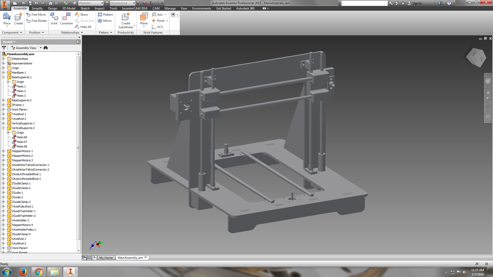

# LizardPrint
##A Plastic and Conductive Ink 3D Printer
Sarika Bajaj, Gaurav Lahiry, Marie Bremner, Shivang Chordia 

This project involves designing and implementing a 3D printer (inspired from the RepRap printer, iTopie) such that plastic and conductive ink can be extruded to print completely integrated electromechanical systems that have embedded circuits in between plastic layers. 

## Current CAD Files of the 3D Printer

## Bill of Materials
* 2 18" x 24" pieces of black plastic
* 1 kg of blue ABS filament
* 5 Stepper motors (NEMA17) 
* 1 Sanguinololu
* 3 limit switches
* 2 3/8" threaded rods (15")
* 3 3/8" unthreaded rods (36")
* 1 Hot End Extruder (Bowden Extruder) 
