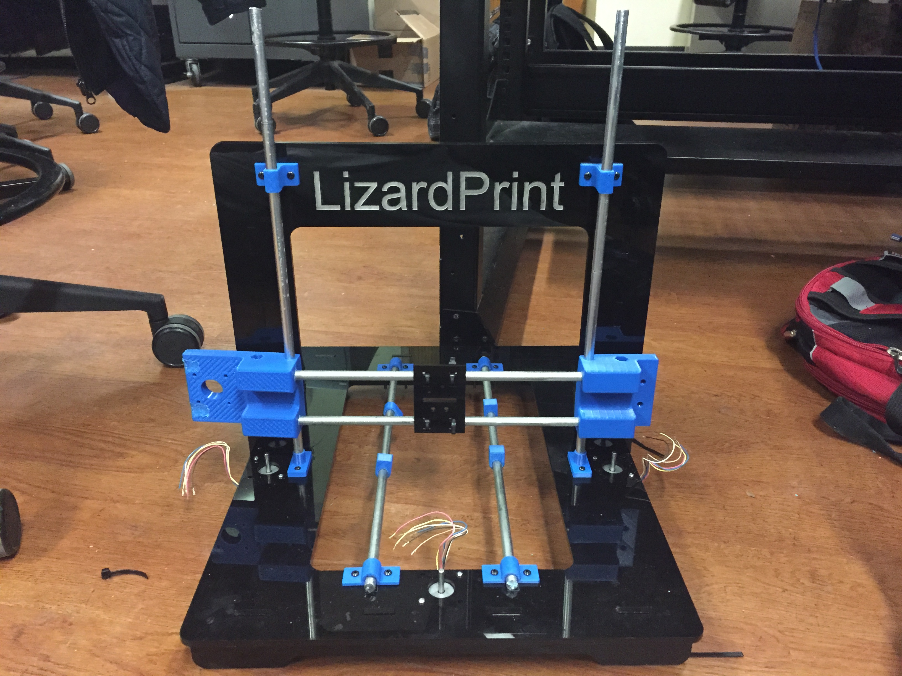

# LizardPrint
A Plastic and Conductive Ink 3D Printer

This project involves designing and implementing a 3D printer (inspired from the RepRap printer, iTopie) such that plastic and conductive ink can be extruded to print completely integrated electromechanical systems that have embedded circuits in between plastic layers. 

